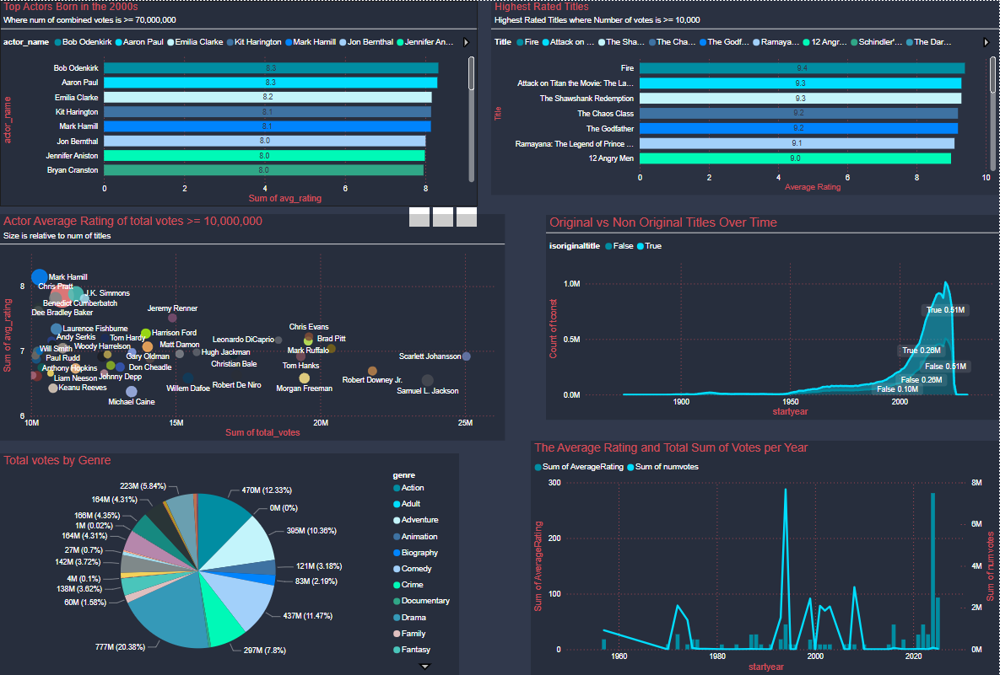

# 🎬 IMDb Data Pipeline with PostgreSQL & Tableau/PowerBI 📊

## 📌 Project Overview
This project automates (soon) the extraction, transformation, and loading (ETL) of IMDb datasets into **PostgreSQL**, ensuring that **Tableau/PowerBI visualizations** are continuously updated.

- 🔄 **Daily IMDb Dataset Updates**
- 🗃 **PostgreSQL Database Storage**
- 🚀 **Automated Processing with Python**
- 📊 **Data Visualization in Tableau/PowerBI**
- 🔢 **10M - 100M+ Rows**
---
 
## 📂 Dataset Information
The IMDb datasets are updated daily and available in TSV format:
- 🎭 `title.basics.tsv.gz` - Movie & TV show metadata
- 🎬 `title.akas.tsv.gz` - Alternate titles
- 👥 `name.basics.tsv.gz` - Actors, directors, and other people
- 🎥 `title.crew.tsv.gz` - Directors & writers
- 📺 `title.episode.tsv.gz` - TV series episode details
- 🎭 `title.principals.tsv.gz` - Main actors & roles
- ⭐ `title.ratings.tsv.gz` - IMDb ratings

The official IMDb dataset source:  
🔗 [IMDb Datasets](https://developer.imdb.com/non-commercial-datasets/)


## ⚙️ Installation & Setup

### 1️⃣ **Clone the Repository**
```bash
git clone https://github.com/DaneRamirez/IMDB_DataAnalysis-WIP-.git
cd repositoryname
```
### 2️⃣ Create a Virtual Environment
```bash
python -m venv venv
source venv/bin/activate   # On macOS/Linux
venv\Scripts\activate      # On Windows
```
### 3️⃣ Install Dependencies
```bash
pip install -r requirements.txt
```
### 4️⃣ Set Up PostgreSQL Database
```sql
CREATE DATABASE imdb_data; --or whatever name you want--
```
Create and Modify .env to include your PostgreSQL credentials:
```bash
DB_HOST=localhost
DB_PORT=port
DB_NAME=db name
DB_USER=your_username
DB_PASS=your_password
```

### 5️⃣ Create Tables
Run the provided Stored Procedure (createstatements.sql) to create tables (or make your own)
```bash
psql -U your_username -d imdb_data -f createstatements.sql

```

### 6️⃣ Download and Extract IMDb Data
```
python download.py
python extract.py

```

### 7️⃣ Load Data into PostgreSQL

```
python process_data.py
```

### 8️⃣ (Optional) Run Materialized Views
Run the materialized views.sql as an example query.
These are just optional and an example ofcourse. 
You are free to make your own

### 🔄 Automating the Pipeline (CRON)
Run a simple cron job
that runs download.py, extract.py, and download.py


### 🔄 Automating the Pipeline (Airflow)
Coming soon

## 📌 Plans:
- Implement Overwriting
- Implement apache airflow for scheduling
- Dockerization
- Analysis

##### This project is a comprehensive exploration of IMDb data, from raw datasets to actionable insights. Feel free to explore the code and contribute!